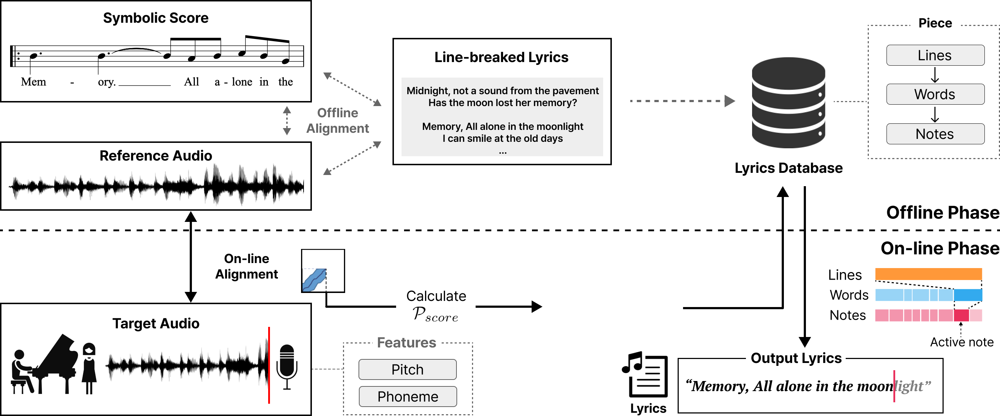
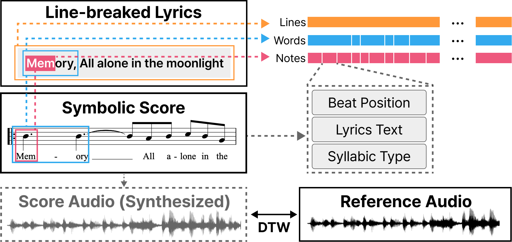
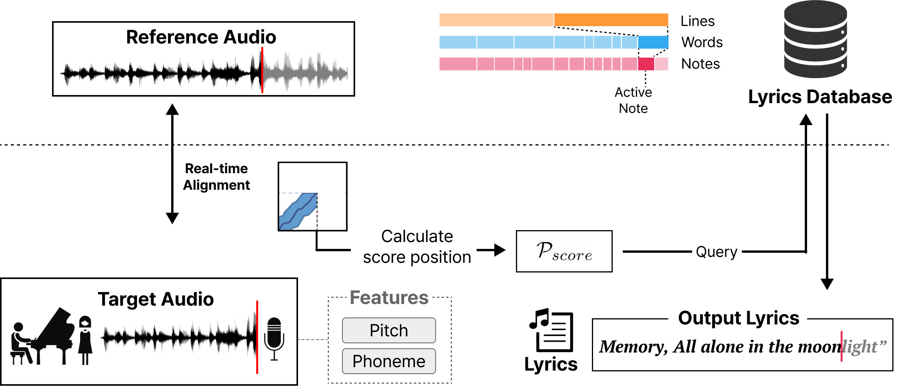
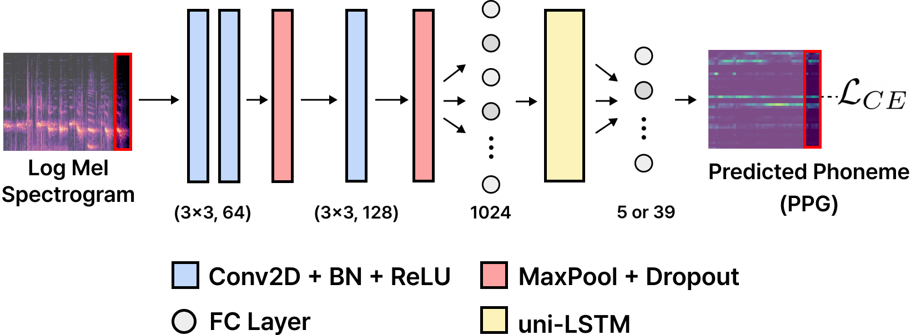
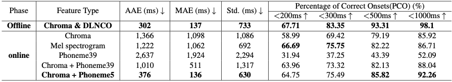

## A Real-Time Lyrics Alignment System Using Chroma and Phonetic Features for Classical Singing Performance

## Demo Video

  <iframe width="832" height="468" src="https://www.youtube.com/embed/FNcr7OByZ94?si=aQoZqSp24QypxbEd" title="YouTube video player" frameborder="0" allow="accelerometer; autoplay; clipboard-write; encrypted-media; gyroscope; picture-in-picture; web-share" allowfullscreen></iframe>

## Abstract

The goal of real-time lyrics alignment is to take live singing audio as input and to pinpoint the exact position within given lyrics on the fly. 
The task can benefit real-world applications such as the automatic subtitling of live concerts or operas. 
However, designing a real-time model poses a great challenge due to the constraints of only using past input and operating within a minimal latency. 
Furthermore, due to the lack of datasets for real-time models, previous studies have mostly evaluated with private in-house datasets, resulting in a lack of standard evaluation methods. 
This paper presents a real-time lyrics alignment system for classical vocal performances with two contributions. 
First, we improve the lyrics alignment algorithm by finding an optimal combination of chromagram and phonetic posteriorgram (PPG) that capture melodic and phonetics features of the singing voice, respectively. 
Second, we recast the Schubert Winterreise Dataset (SWD) which contains multiple performance renditions of the same pieces as an evaluation set for the real-time lyrics alignment.

## System Design

**Figure 1.** An overview of the proposed real-time lyrics alignment system.

### Offline Phase

    

**Figure 2.** The pipeline of an offline phase aligning *reference* audio and lyrics by extracting *score* audio and annotation from the symbolic score.

The offline phase aims to obtain precise alignment between the *reference* audio and lyrics so that the system can calculate the lyrical position only from *reference* and target audio in online phase, as illustrated in Figure 2.

### Online Phase

    

The online phase includes online alignment algorithm between target audio and ref audio with feature extraction on the fly. 

### Acoustic Model

    

**Figure 3.** The network architecture of the proposed acoustic model

Using the CRNN as the backbone architecture, our proposed acoustic model consists of a single CRNN network with a dense layer that takes log-scaled mel-spectrogram and outputs a phonetic posteriorgram (PPG) matrix as illustrated in Fig.3. The overall architecture is taken from the framewise phoneme classifier in [1], but modified to be suitable for real-time.

## Datasets

We reconstructed Schubert Winterreise Dataset(SWD) [2] into winterreise rt, a subset that enables the benchmark evaluation of real-time lyrics alignment models.
For detailed information about the dataset, please refer to [here](https://github.com/laurenceyoon/winterreise_rt).

## Evaluation

**Table 1.** Results of offline & online alignment on *winterreise_rt* dataset. Offline alignment results are evaluated with each ground-truth(GT) of score and ref, and online alignment results are evaluated with each GT of ref and target using each feature type (all values are averaged over 24 songs with voice note-level evaluation).

    

According to the online alignment results from Table 1, our model that uses Chroma & Phoneme5 outperforms all other feature types in AAE (376 ms) and MAE (136 ms), and is even comparable to the offline results.

**Figure 4.** Warping path results with and without phoneme features of ‘No. 11, Fru ̈hlingstraum’ from Winterreise song cycle. The red dots represent GT pairs for voice notes, the purple dots with the warping path results of each model, and the white line with the silence part.

## Reference

[1] Sangeon Yong, Li Su, and Juhan Nam, “A phoneme-informed neural network model for note-level singing transcription,” in International Conference on Acoustics, Speech and Signal Processing (ICASSP). IEEE, 2023.
[2] Christof Weiß, Frank Zalkow, Vlora Arifi-Müller, Meinard Mu ̈ller, Hendrik Vincent Koops, Anja Volk, and Harald G Grohganz, “Schubert winterreise dataset: A multimodal scenario for music analysis,” Journal on Computing and Cultural Heritage (JOCCH), vol. 14, no. 2, pp. 1–18, 2021.